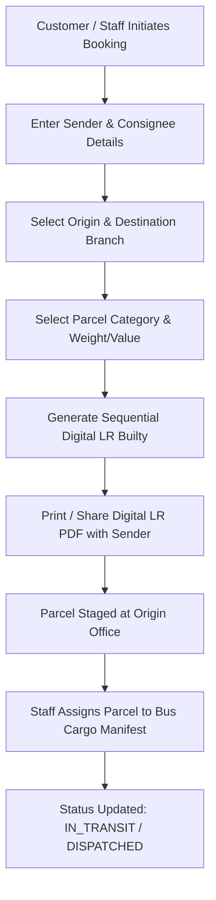
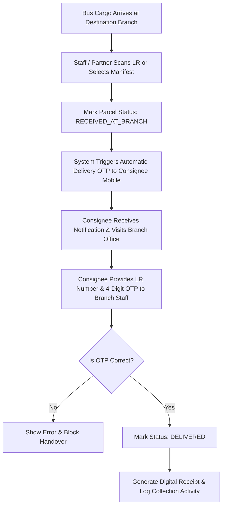

# 📦 ShipKart System Guide & Operational Architecture
> **Official Logistics & Builty Management Platform for Pooja Travels & Cargo**

---

## 📋 Table of Contents
1. [Platform Overview & Core Concepts](#-platform-overview--core-concepts)
2. [End-to-End Parcel Lifecycle & Flowcharts](#-end-to-end-parcel-lifecycle--flowcharts)
   - [1. Booking & Bus Dispatch Flow](#1-booking--bus-dispatch-flow)
   - [2. Branch Arrival & Customer Delivery (OTP Flow)](#2-branch-arrival--customer-delivery-otp-flow)
3. [Portal Breakdown & Role Capabilities](#-portal-breakdown--role-capabilities)
   - [1. Customer Portal](#1-customer-portal-)
   - [2. Employee / Staff Terminal](#2-employee--staff-terminal-)
   - [3. Partner Office Terminal](#3-partner-office-terminal-)
   - [4. Admin Console](#4-admin-console-)
4. [Route & Feature Master Chart](#-route--feature-master-chart)
5. [Key System Modules & Security Features](#-key-system-modules--security-features)

---

## 🚀 Platform Overview & Core Concepts

ShipKart is a digitized bus cargo management and digital Lorry Receipt (LR) builty system tailored for overnight bus logistics across Rajasthan and interstate routes.

### Key Operational Rules:
- **Station Office Pickup Model**: No home delivery. Parcels are safely transported from origin branch to destination branch offices where consignees pick them up.
- **Sequential Digital LR (Builty)**: Every parcel booking receives an auto-incrementing, collision-safe digital LR number (e.g. `0001`, `0002`).
- **OTP-Verified Handover**: High-security delivery verification where consignees receive a 4-digit OTP upon parcel arrival at the destination branch.

---

## 🔄 End-to-End Parcel Lifecycle & Flowcharts

### 1. Booking & Bus Dispatch Flow



---

### 2. Branch Arrival & Customer Delivery (OTP Flow)



---

## 🏛️ Portal Breakdown & Role Capabilities

```
                  ┌─────────────────────────────────────────┐
                  │          SHIPKART UNIFIED SYSTEM        │
                  └────────────────────┬────────────────────┘
                                       │
         ┌──────────────────┬──────────┴───────────┬──────────────────┐
         ▼                  ▼                      ▼                  ▼
┌──────────────────┐┌──────────────────┐┌──────────────────┐┌──────────────────┐
│ CUSTOMER PORTAL  ││ STAFF TERMINAL   ││ PARTNER TERMINAL ││  ADMIN CONSOLE   │
│  (/customer)     ││   (/employee)    ││   (/partner)     ││    (/admin)      │
└──────────────────┘└──────────────────┘└──────────────────┘└──────────────────┘
```

---

### 1. Customer Portal (`/customer`)
**Target Audience**: Senders, Receivers, and Retail Customers.

* **Capabilities & Features**:
  - **Online Parcel Booking**: Book shipments from home with instant weight/category tariff calculations.
  - **Real-Time Consignment Tracking**: Track live status of LR numbers without login or with full dashboard history.
  - **Digital LR Downloads**: View, print, or download PDF builty receipts anytime.
  - **Booking History**: Overview of active, in-transit, and past delivered shipments.
  - **Profile & Saved Addresses**: Manage frequent contacts and destination branch preferences.

---

### 2. Employee / Staff Terminal (`/employee`)
**Target Audience**: Station Managers, Loading Staff, and Counter Clerks.

* **Capabilities & Features**:
  - **Counter Parcel Booking**: Rapid counter booking with thermal printer receipt support and cash/online collection.
  - **Bus Cargo Loading & Dispatch**: Group parcels into bus manifests and mark transit dispatches.
  - **Arrival Management**: Receive incoming bus shipments at destination terminals.
  - **OTP Delivery Verification**: Verify 4-digit customer OTPs before handing over parcels.
  - **Daily Collection Ledger**: Track daily cash collections, freight totals, and station balance.

---

### 3. Partner Office Terminal (`/partner`)
**Target Audience**: Franchise Owners, External Agency Terminals, and Route Partners.

* **Capabilities & Features**:
  - **Incoming Cargo Manifest**: View all bus cargoes heading to the partner's station.
  - **Station Parcel Receiving**: Accept parcels into local branch inventory.
  - **Local OTP Handover**: Complete consignee deliveries and record local pickups.
  - **Partner Reports & Revenue**: View commission, handled parcel volume, and performance summaries.

---

### 4. Admin Console (`/admin`)
**Target Audience**: System Administrators, Operations Directors, and Regional Managers.

* **Capabilities & Features**:
  - **Live Operations Dashboard**: Monitor active dispatches, revenue trends, and system health.
  - **Branch & Office Management**: Create, edit, and configure station offices, contacts, and helplines.
  - **Employee & Partner User Control**: Manage staff credentials, role permissions, and branch assignments.
  - **SLA & Route Analytics**: Monitor 90% next-day delivery compliance and transit performance across Rajasthan and interstate lines.
  - **Dynamic Tariff Management**: Adjust rate cards for Envelopes, Boxes, Medium, and Large bundles.

---

## 📊 Route & Feature Master Chart

| Route Path | Portal / Section | Target Persona | Key Feature Description |
| :--- | :--- | :--- | :--- |
| `/` | Public Home | All Visitors | Hero search, instant LR tracker, pricing tariffs, Rajasthan coverage map |
| `/track/[lrNumber]` | Public Tracking | Senders & Consignees | Detailed timeline of parcel journey from booking to handover |
| `/lr/[lrNumber]` | Digital Builty | Senders & Staff | Printable, downloadable official PDF Lorry Receipt |
| `/offices` | Branch Directory | Public & Customers | Interactive directory of branch offices, contacts, and operating hours |
| `/login` | Unified Auth | All Users | Role-based login (Customer, Staff, Partner, Admin) |
| `/customer` | Customer Portal | Customers | Personal dashboard with active shipments and quick actions |
| `/customer/book` | Customer Booking | Customers | Multi-step online parcel booking form |
| `/customer/history` | Customer History | Customers | Filterable history of previous shipments |
| `/employee` | Staff Terminal | Station Staff | Main counter dashboard for bookings, dispatches, and arrivals |
| `/employee/book` | Staff Counter Book | Station Staff | Quick counter booking for walk-in senders |
| `/employee/dispatches` | Staff Dispatches | Station Staff | Bus cargo assignment and manifest dispatching |
| `/employee/collections` | Staff Handover | Station Staff | OTP verification and customer parcel handover |
| `/partner` | Partner Terminal | Partner Franchise | Partner office dashboard and incoming cargo list |
| `/partner/incoming` | Partner Incoming | Partner Franchise | Station arrival confirmation for incoming buses |
| `/partner/collections` | Partner Handover | Partner Franchise | Local customer OTP verification and delivery |
| `/admin` | Admin Console | System Admin | System-wide analytics, total revenue, and quick status overview |
| `/admin/monitoring/sla` | Admin SLA | Operations Team | 90% Next-Day delivery SLA performance monitor |
| `/admin/reports/bookings` | Admin Reports | Management | Detailed booking data, route analytics, and exportable financial logs |
| `/admin/offices` | Admin Offices | System Admin | Add, edit, or disable branch offices and station helplines |
| `/admin/employees` | Admin Staff Mgmt | System Admin | Employee account management and branch assignments |

---

## 🔒 Key System Modules & Security Features

1. **Sequential LR Guarantee**:
   - Engine ensures non-duplicate, strictly incremental LR numbers across concurrent staff bookings.

2. **Delivery OTP Security**:
   - 4-digit time-sensitive OTP generated upon branch arrival.
   - Requires staff/partner verification on delivery to prevent misplacement or fraudulent claims.

3. **Multi-Tenant Station Scoping**:
   - Staff and Partner accounts operate strictly within their assigned branch context.

4. **Multi-Language Support (i18n)**:
   - Instant toggle between **English** and **Hindi (हिन्दी)** across public and customer-facing components.
